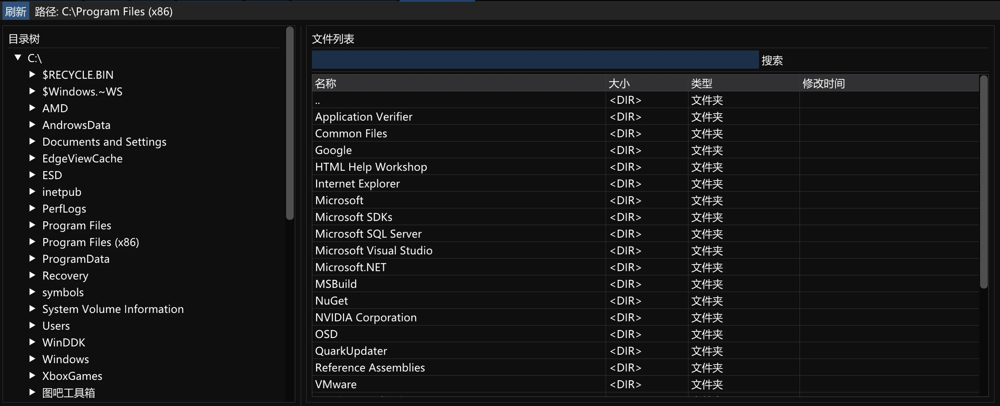

# Windows文件浏览器 (File Explorer)

[](https://www.microsoft.com/windows)
[](https://isocpp.org/)

> 基于ImGui和Windows API开发的文件浏览器组件，C++17

[English](README.en.md) | 中文

## 📖 项目简介

本项目是一个Windows文件浏览器组件，采用ImGui即时模式GUI框架构建。因写ark的时候需要文件系统而写，它提供了直观的文件系统浏览界面，支持树形目录结构和详细文件列表显示。



## 🏗️ 技术架构

### 组件设计

```
┌─────────────────┐    ┌──────────────────┐
│   FileWnd       │────│   FileManager    │
│  (UI渲染层)     │    │  (数据处理层)    │
└─────────────────┘    └──────────────────┘
         │                       │
         ▼                       ▼
┌─────────────────┐    ┌──────────────────┐
│   ImGui API     │    │  Windows API     │
│   (界面框架)    │    │  (文件系统)     │
└─────────────────┘    └──────────────────┘
```

### 核心类结构

#### FileManager (文件管理器)
```cpp
class FileManager {
    // 核心功能
    bool LoadDrives();                    // 加载驱动器列表
    bool LoadDirectory(const string& path); // 加载指定目录
    vector<FileItem> GetFiles(const string& path); // 获取文件列表
    
    // 工具函数
    string FormatFileSize(LARGE_INTEGER size);     // 格式化文件大小
    string FormatFileTime(FILETIME time);          // 格式化时间
    
private:
    map<string, DirectoryNode> directoryCache_;    // 目录缓存
    vector<string> driveList_;                     // 驱动器列表
};
```

#### FileWnd (文件窗口)
```cpp
class FileWnd : public ImguiWnd {
    void Render(bool* p_open = nullptr);           // 渲染主界面
    void RenderDirectoryTree();                    // 渲染目录树
    void RenderFileList();                         // 渲染文件列表
    
private:
    FileManager fileManager_;                      // 文件管理器实例
    string currentPath_;                           // 当前路径
    vector<FileItem> currentFiles_;                // 当前文件列表
};
```

### 数据结构

#### FileItem (文件项)
```cpp
struct FileItem {
    string fileName;          // 文件名
    string fullPath;          // 完整路径
    LARGE_INTEGER fileSize;   // 文件大小
    DWORD attributes;         // 文件属性
    FILETIME createTime;      // 创建时间
    FILETIME modifyTime;      // 修改时间
    bool isDirectory;         // 是否目录
    string fileType;          // 文件类型
};
```

## 🚀 使用方法

### 集成到现有项目

```cpp
// 1. 包含头文件
#include "FileWnd.h"

// 2. 在应用类中添加成员
class YourApp {
private:
    FileWnd fileWnd_;
    bool showFileExplorer_ = false;
};

// 3. 在渲染循环中调用
void YourApp::Render() {
    if (showFileExplorer_) {
        fileWnd_.Render(&showFileExplorer_);
    }
}
```

### 交互操作

#### 目录树操作
- **点击箭头** ▶️ 展开/收起子目录
- **点击文本** 📁 在右侧显示目录内容
- **自动加载** 🔄 按需加载子目录

#### 文件列表操作
- **单击选择** 🖱️ 高亮选中文件
- **双击目录** 📂 进入子目录
- **点击".."** ⬆️ 返回上级目录
- **搜索过滤** 🔍 实时过滤文件名

## 📚 API文档

### FileManager API

| 方法 | 描述 | 返回值 |
|------|------|---------|
| `LoadDrives()` | 加载系统驱动器列表 | `bool` - 成功/失败 |
| `LoadDirectory(path)` | 加载指定目录内容 | `bool` - 成功/失败 |
| `GetFiles(path)` | 获取目录中的文件列表 | `vector<FileItem>` |
| `GetSubDirectories(path)` | 获取子目录列表 | `vector<DirectoryNode>` |
| `FormatFileSize(size)` | 格式化文件大小显示 | `string` - 如"1.5 MB" |
| `FormatFileTime(time)` | 格式化时间显示 | `string` - 如"2024-01-15 14:30" |

### FileWnd API

| 方法 | 描述 | 参数 |
|------|------|------|
| `Render(p_open)` | 渲染文件浏览器窗口 | `bool*` - 窗口开关状态 |
| `ChangeDirectory(path)` | 切换到指定目录 | `const string&` - 目标路径 |
| `FlushCurrentDirectory()` | 刷新当前目录内容 | 无 |
| `NavigateUp()` | 导航到上级目录 | 无 |

---

⭐ 如果这个项目对你有帮助，请给个Star支持一下！

